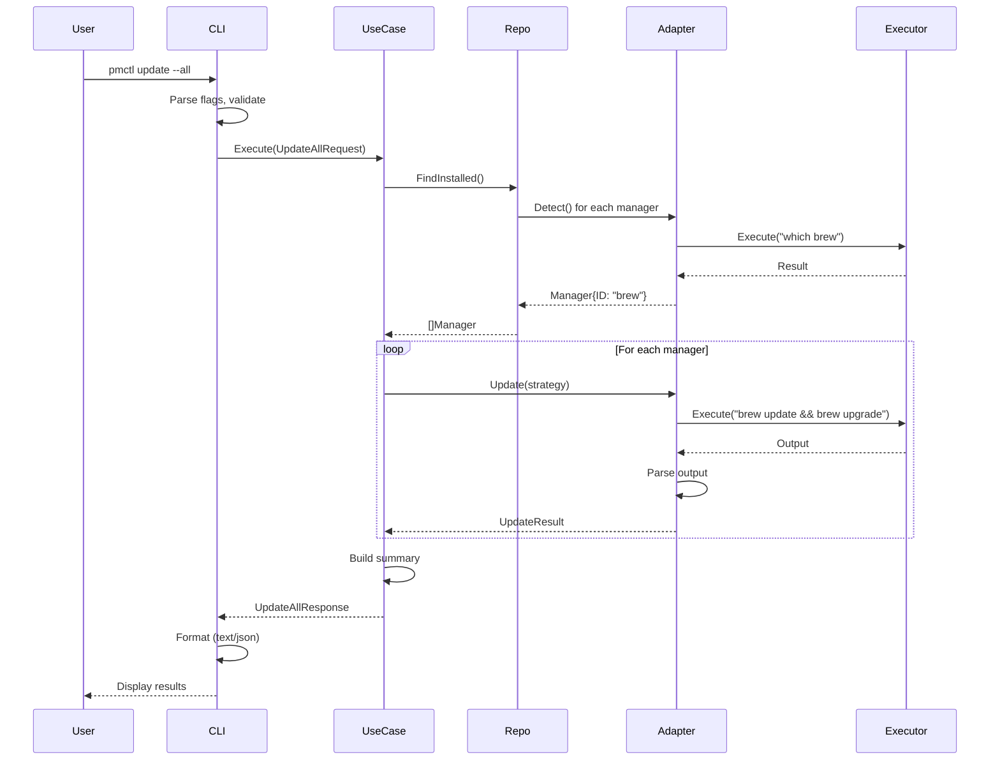

# Architecture: gzh-cli-package-manager

> **Version**: 1.0.0
> **Last Updated**: 2025-01-27
> **Status**: Draft

---

## Executive Summary

`gzh-cli-package-manager` follows **Clean Architecture** principles with **Hexagonal (Ports & Adapters)** pattern to ensure long-term maintainability, testability, and extensibility.

**Key Architectural Decisions**:
1. **Domain-Driven Design**: Business logic isolated from infrastructure
2. **Dependency Inversion**: High-level modules don't depend on low-level details
3. **Single Responsibility**: Each layer has one reason to change
4. **Testability**: Every layer independently testable with mocks

**Architecture Guarantees**:
- 5+ year lifespan with manageable complexity
- Easy addition of new package managers (plugin architecture)
- Swappable infrastructure (CLI → GUI, YAML → Database)
- 90%+ test coverage achievable

---

## Table of Contents

- [1. Architecture Principles](#1-architecture-principles)
- [2. Layer Architecture](#2-layer-architecture)
- [3. Directory Structure](#3-directory-structure)
- [4. Component Design](#4-component-design)
- [5. Data Flow](#5-data-flow)
- [6. Dependency Rules](#6-dependency-rules)
- [7. Testing Strategy](#7-testing-strategy)
- [8. Technology Stack](#8-technology-stack)
- [9. Deployment Architecture](#9-deployment-architecture)

---

## 1. Architecture Principles

### 1.1 Clean Architecture Layers

```
┌─────────────────────────────────────────────┐
│  Presentation Layer (cmd/pmctl)             │  ← Frameworks & Drivers
│  - CLI Commands (Cobra)                     │
│  - Formatters (Text, JSON)                  │
│  - Input Validation                         │
├─────────────────────────────────────────────┤
│  Application Layer (pkg/application)        │  ← Use Cases
│  - Use Case Orchestration                   │
│  - Business Workflows                       │
│  - Input/Output Ports                       │
├─────────────────────────────────────────────┤
│  Domain Layer (pkg/domain)                  │  ← Entities & Business Rules
│  - Core Entities (Manager, Package)         │
│  - Business Logic (Update Strategies)       │
│  - Repository Interfaces                    │
│  - Domain Services                          │
├─────────────────────────────────────────────┤
│  Infrastructure Layer (pkg/infrastructure)  │  ← External Interfaces
│  - Package Manager Adapters                 │
│  - Command Execution                        │
│  - File System Operations                   │
│  - Repository Implementations               │
└─────────────────────────────────────────────┘
```

**Dependency Direction**: Outer layers depend on inner layers, never the reverse.

---

### 1.2 Hexagonal Architecture (Ports & Adapters)

```
                        Application Core
                    ┌─────────────────────┐
                    │   Domain Layer      │
                    │  (Business Rules)   │
                    └──────────┬──────────┘
                               │
                    ┌──────────┴──────────┐
                    │  Application Layer  │
                    │   (Use Cases)       │
                    └──┬────────────────┬─┘
                       │                │
            ┌──────────┴───┐     ┌─────┴──────────┐
            │ Input Ports  │     │ Output Ports   │
            │ (Driven)     │     │ (Driving)      │
            └──────┬───────┘     └────────┬───────┘
                   │                      │
       ┌───────────┴─────────┐  ┌────────┴─────────────┐
       │  Primary Adapters   │  │ Secondary Adapters   │
       │  - CLI (Cobra)      │  │ - Homebrew Adapter   │
       │  - REST API (future)│  │ - ASDF Adapter       │
       └─────────────────────┘  │ - File System        │
                                │ - Command Executor   │
                                └──────────────────────┘
```

**Benefits**:
- Application core is framework-agnostic
- Easy to swap adapters (e.g., CLI → GUI)
- Testable without external dependencies

---

### 1.3 SOLID Principles Application

**Single Responsibility Principle (SRP)**:
- Each package has one reason to change
- Example: `pkg/domain/manager` only knows about package manager concepts

**Open/Closed Principle (OCP)**:
- New package managers added without modifying core
- Strategy pattern for update strategies

**Liskov Substitution Principle (LSP)**:
- All manager adapters implement same interface
- Swappable without breaking client code

**Interface Segregation Principle (ISP)**:
- Small, focused interfaces (ManagerDetector, VersionParser)
- Clients depend only on methods they use

**Dependency Inversion Principle (DIP)**:
- High-level (use cases) depend on abstractions (ports)
- Low-level (adapters) implement abstractions

---

## 2. Layer Architecture

### 2.1 Domain Layer (pkg/domain)

**Responsibility**: Core business logic and entities

**No Dependencies On**:
- External libraries (except Go stdlib)
- Infrastructure details
- Frameworks (Cobra, YAML libraries)

**Components**:

```go
pkg/domain/
├── manager/                    # Package manager domain
│   ├── entity.go              # Manager, Package, Platform entities
│   ├── repository.go          # ManagerRepository interface
│   ├── service.go             # ManagerService (domain logic)
│   ├── types.go               # ManagerType, Status enums
│   └── manager_test.go        # Pure unit tests
├── update/                     # Update domain
│   ├── strategy.go            # UpdateStrategy interface + implementations
│   ├── executor.go            # UpdateExecutor interface
│   ├── version.go             # Version comparison logic
│   └── update_test.go
├── diagnostics/                # Health check domain
│   ├── duplicate_detector.go  # Duplicate binary detection
│   ├── health_checker.go      # Health check logic
│   └── diagnostics_test.go
└── error/                      # Domain-specific errors
    └── errors.go
```

**Example Entity**:

```go
// pkg/domain/manager/entity.go
package manager

type Manager struct {
    ID          ManagerID      // Unique identifier (brew, asdf, npm)
    Name        string         // Display name
    Type        ManagerType    // System, Version, Language
    Platform    Platform       // darwin, linux, windows
    Installed   bool
    Version     string
    ConfigPath  string
    Packages    []Package
}

type Package struct {
    Name             string
    CurrentVersion   string
    AvailableVersion string
    Manager          ManagerID
    SizeMB           float64
    UpdateType       UpdateType  // Major, Minor, Patch
}
```

**Example Domain Service**:

```go
// pkg/domain/update/strategy.go
package update

// Strategy interface (domain abstraction)
type UpdateStrategy interface {
    SelectVersion(current string, available []string) (string, error)
    ShouldUpdate(current, available string) bool
}

// Stable strategy (domain logic)
type StableStrategy struct{}

func (s *StableStrategy) SelectVersion(current string, available []string) (string, error) {
    // Pure business logic: filter out beta/rc, select latest stable
    stableVersions := filterStableVersions(available)
    return selectLatest(stableVersions), nil
}
```

**Testing**: 95%+ coverage, no mocks needed (pure functions).

---

### 2.2 Application Layer (pkg/application)

**Responsibility**: Use case orchestration and workflows

**Dependencies**:
- Domain layer (entities, interfaces)
- Port interfaces (defined here)

**No Dependencies On**:
- Infrastructure implementations
- Frameworks

**Components**:

```go
pkg/application/
├── bootstrap/                   # Bootstrap use cases
│   ├── install_manager.go      # InstallManagerUseCase
│   ├── check_installation.go   # CheckInstallationUseCase
│   ├── configure_manager.go    # ConfigureManagerUseCase
│   └── bootstrap_test.go       # Use case tests (mocked ports)
├── update/                      # Update use cases
│   ├── update_all.go           # UpdateAllManagersUseCase
│   ├── update_single.go        # UpdateSingleManagerUseCase
│   ├── dry_run.go              # DryRunAnalysisUseCase
│   └── update_test.go
├── sync/                        # Sync use cases
│   ├── check_sync.go           # CheckSyncStatusUseCase
│   ├── synchronize.go          # SynchronizeVersionsUseCase
│   └── sync_test.go
├── port/                        # Port interfaces
│   ├── input/                  # Input ports (use case interfaces)
│   │   ├── bootstrap_port.go
│   │   ├── update_port.go
│   │   └── sync_port.go
│   └── output/                 # Output ports (driven interfaces)
│       ├── executor_port.go    # CommandExecutor interface
│       ├── logger_port.go      # Logger interface
│       ├── notifier_port.go    # Notifier interface
│       └── repository_port.go  # Repository interfaces
└── dto/                         # Data Transfer Objects
    ├── bootstrap_dto.go
    ├── update_dto.go
    └── sync_dto.go
```

**Example Use Case**:

```go
// pkg/application/update/update_all.go
package update

import (
    "context"
    "github.com/gizzahub/gzh-cli-package-manager/pkg/application/dto"
    "github.com/gizzahub/gzh-cli-package-manager/pkg/application/port"
    "github.com/gizzahub/gzh-cli-package-manager/pkg/domain/manager"
)

type UpdateAllManagersUseCase struct {
    managerRepo  port.ManagerRepository    // Output port
    executor     port.CommandExecutor      // Output port
    logger       port.Logger               // Output port
    strategy     domain.UpdateStrategy     // Domain service
}

func (uc *UpdateAllManagersUseCase) Execute(
    ctx context.Context,
    req *dto.UpdateAllRequest,
) (*dto.UpdateAllResponse, error) {
    // 1. Validate input
    if err := req.Validate(); err != nil {
        return nil, err
    }

    // 2. Get installed managers
    managers, err := uc.managerRepo.FindInstalled(ctx)
    if err != nil {
        return nil, err
    }

    // 3. Execute updates for each manager
    results := make([]*dto.UpdateResult, 0, len(managers))
    for _, mgr := range managers {
        result, err := uc.updateSingleManager(ctx, mgr, req.Strategy)
        if err != nil {
            uc.logger.Error("Update failed", err, logger.Field("manager", mgr.ID))
            result.Status = dto.StatusFailed
            result.Error = err
        }
        results = append(results, result)
    }

    // 4. Build response
    return &dto.UpdateAllResponse{
        Results:  results,
        Summary:  uc.buildSummary(results),
        Duration: time.Since(start),
    }, nil
}
```

**Testing**: 90%+ coverage, all ports mocked.

---

### 2.3 Infrastructure Layer (pkg/infrastructure)

**Responsibility**: External system integrations

**Dependencies**:
- Domain layer (implements domain interfaces)
- Application layer (implements output ports)
- External libraries (allowed here)

**Components**:

```go
pkg/infrastructure/
├── adapter/
│   ├── manager/                 # Package manager adapters
│   │   ├── homebrew/
│   │   │   ├── adapter.go      # Homebrew implementation
│   │   │   ├── detector.go     # Detection logic
│   │   │   ├── parser.go       # Output parsing
│   │   │   └── adapter_test.go # Integration tests
│   │   ├── asdf/
│   │   │   ├── adapter.go
│   │   │   ├── plugin_manager.go
│   │   │   └── adapter_test.go
│   │   ├── npm/
│   │   ├── pip/
│   │   ├── apt/
│   │   └── factory.go          # Manager factory
│   ├── executor/                # Command execution
│   │   ├── shell_executor.go   # Real shell execution
│   │   ├── mock_executor.go    # Mock for testing
│   │   └── executor_test.go
│   └── filesystem/              # File operations
│       ├── config_loader.go
│       ├── state_persister.go
│       └── filesystem_test.go
├── repository/                  # Repository implementations
│   ├── memory/                  # In-memory (for testing)
│   │   └── manager_repository.go
│   └── yaml/                    # YAML-based persistence
│       ├── config_repository.go
│       ├── state_repository.go
│       └── yaml_test.go
└── platform/                    # Platform detection
    ├── detector.go
    ├── darwin/
    ├── linux/
    ├── windows/
    └── detector_test.go
```

**Example Adapter**:

```go
// pkg/infrastructure/adapter/manager/homebrew/adapter.go
package homebrew

import (
    "context"
    "github.com/gizzahub/gzh-cli-package-manager/pkg/application/port"
    "github.com/gizzahub/gzh-cli-package-manager/pkg/domain/manager"
)

type HomebrewAdapter struct {
    executor port.CommandExecutor
    logger   port.Logger
}

// Implements ManagerAdapter interface
func (a *HomebrewAdapter) Detect(ctx context.Context) (bool, error) {
    result, err := a.executor.Execute(ctx, "which", "brew")
    return err == nil && result.ExitCode == 0, nil
}

func (a *HomebrewAdapter) GetVersion(ctx context.Context) (string, error) {
    result, err := a.executor.Execute(ctx, "brew", "--version")
    if err != nil {
        return "", err
    }
    return parseBrewVersion(result.Stdout), nil
}

func (a *HomebrewAdapter) Update(ctx context.Context, opts UpdateOptions) (*UpdateResult, error) {
    // 1. brew update (refresh package database)
    if err := a.brewUpdate(ctx); err != nil {
        return nil, err
    }

    // 2. brew upgrade (upgrade packages)
    packages, err := a.brewUpgrade(ctx, opts.DryRun)
    if err != nil {
        return nil, err
    }

    // 3. brew cleanup (free disk space)
    freedMB, err := a.brewCleanup(ctx)
    if err != nil {
        a.logger.Warn("Cleanup failed", logger.Field("error", err))
    }

    return &UpdateResult{
        Packages: packages,
        FreedMB:  freedMB,
    }, nil
}

func parseBrewVersion(output string) string {
    // Homebrew 4.2.0
    parts := strings.Fields(output)
    if len(parts) >= 2 {
        return parts[1]
    }
    return "unknown"
}
```

**Testing**: 85%+ coverage, Docker-based integration tests.

---

### 2.4 Presentation Layer (cmd/pmctl)

**Responsibility**: User interface (CLI)

**Dependencies**:
- Application layer (use cases)
- Infrastructure layer (for dependency injection)
- Cobra framework

**Components**:

```go
cmd/pmctl/
├── main.go                      # Entry point, DI setup
├── command/                     # Cobra commands
│   ├── root.go                 # Root command
│   ├── update.go               # Update command
│   ├── status.go               # Status command
│   ├── bootstrap.go            # Bootstrap command
│   ├── sync.go                 # Sync command
│   ├── export.go               # Export command
│   └── cache.go                # Cache command
├── formatter/                   # Output formatters
│   ├── text_formatter.go       # Enhanced text output
│   ├── json_formatter.go       # JSON output
│   ├── table_formatter.go      # Table output
│   └── formatter_test.go
└── validator/                   # Input validation
    ├── flag_validator.go
    └── validator_test.go
```

**Example Command**:

```go
// cmd/pmctl/command/update.go
package command

import (
    "github.com/spf13/cobra"
    "github.com/gizzahub/gzh-cli-package-manager/pkg/application/update"
)

func NewUpdateCommand(updateUC *update.UpdateAllManagersUseCase) *cobra.Command {
    cmd := &cobra.Command{
        Use:   "update",
        Short: "Update package managers and packages",
        Long:  `Update all or specific package managers and their packages.`,
        RunE: func(cmd *cobra.Command, args []string) error {
            // 1. Parse flags
            all, _ := cmd.Flags().GetBool("all")
            dryRun, _ := cmd.Flags().GetBool("dry-run")
            strategy, _ := cmd.Flags().GetString("strategy")
            outputFormat, _ := cmd.Flags().GetString("output")

            // 2. Build request DTO
            req := &dto.UpdateAllRequest{
                All:      all,
                DryRun:   dryRun,
                Strategy: parseStrategy(strategy),
            }

            // 3. Execute use case
            resp, err := updateUC.Execute(cmd.Context(), req)
            if err != nil {
                return err
            }

            // 4. Format output
            formatter := getFormatter(outputFormat)
            return formatter.FormatUpdateResponse(resp)
        },
    }

    // Flags
    cmd.Flags().BoolP("all", "a", false, "Update all managers")
    cmd.Flags().Bool("dry-run", false, "Preview changes without executing")
    cmd.Flags().String("strategy", "stable", "Update strategy (latest|stable|minor|fixed)")
    cmd.Flags().StringP("output", "o", "text", "Output format (text|json)")

    return cmd
}
```

**Dependency Injection** (main.go):

```go
// cmd/pmctl/main.go
package main

import (
    "github.com/spf13/cobra"
    // ... imports
)

func main() {
    // 1. Initialize infrastructure
    logger := logger.NewStructuredLogger("pmctl")
    executor := executor.NewShellExecutor(logger)

    // 2. Initialize repositories
    configRepo := yaml.NewConfigRepository("~/.config/pmctl", logger)
    managerRepo := repository.NewManagerRepository(executor, logger)

    // 3. Initialize adapters
    homebrewAdapter := homebrew.NewAdapter(executor, logger)
    asdfAdapter := asdf.NewAdapter(executor, logger)
    // ... more adapters

    // Register adapters with factory
    adapterFactory := adapter.NewFactory()
    adapterFactory.Register("brew", homebrewAdapter)
    adapterFactory.Register("asdf", asdfAdapter)

    // 4. Initialize use cases
    updateUC := update.NewUpdateAllManagersUseCase(
        managerRepo,
        executor,
        logger,
        update.NewStableStrategy(),
    )

    bootstrapUC := bootstrap.NewInstallManagerUseCase(
        managerRepo,
        executor,
        logger,
    )

    // 5. Build CLI
    rootCmd := command.NewRootCommand()
    rootCmd.AddCommand(command.NewUpdateCommand(updateUC))
    rootCmd.AddCommand(command.NewBootstrapCommand(bootstrapUC))
    // ... more commands

    // 6. Execute
    if err := rootCmd.Execute(); err != nil {
        logger.Fatal("Command failed", err)
        os.Exit(1)
    }
}
```

---

## 3. Directory Structure

```
gzh-cli-package-manager/
├── cmd/
│   └── pmctl/                   # CLI entry point
│       ├── main.go              # DI setup, main function
│       ├── command/             # Cobra commands
│       ├── formatter/           # Output formatters
│       └── validator/           # Input validation
│
├── pkg/                         # Public packages
│   ├── domain/                  # Domain Layer (NO external deps)
│   │   ├── manager/            # Package manager domain
│   │   ├── update/             # Update domain
│   │   ├── diagnostics/        # Diagnostics domain
│   │   └── error/              # Domain errors
│   │
│   ├── application/             # Application Layer
│   │   ├── bootstrap/          # Bootstrap use cases
│   │   ├── update/             # Update use cases
│   │   ├── sync/               # Sync use cases
│   │   ├── port/               # Port interfaces
│   │   │   ├── input/          # Input ports (use case interfaces)
│   │   │   └── output/         # Output ports (driven interfaces)
│   │   └── dto/                # Data Transfer Objects
│   │
│   └── infrastructure/          # Infrastructure Layer
│       ├── adapter/
│       │   ├── manager/        # Manager adapters (brew, asdf, etc.)
│       │   ├── executor/       # Command execution
│       │   └── filesystem/     # File operations
│       ├── repository/         # Repository implementations
│       │   ├── memory/         # In-memory (testing)
│       │   └── yaml/           # YAML persistence
│       └── platform/           # Platform detection
│
├── internal/                    # Private implementation
│   ├── logger/                 # Logging interface + implementations
│   ├── config/                 # Configuration management
│   └── cli/                    # CLI utilities
│
├── test/                        # Test code
│   ├── unit/                   # Unit tests (by layer)
│   ├── integration/            # Integration tests
│   │   ├── docker/            # Docker-based tests
│   │   │   ├── Dockerfile.ubuntu
│   │   │   ├── Dockerfile.alpine
│   │   │   └── Dockerfile.fedora
│   │   └── testdata/          # Test fixtures
│   └── e2e/                    # End-to-end tests
│
├── docs/                        # Documentation
│   ├── 00-overview/
│   ├── 10-architecture/
│   │   └── adr/                # Architecture Decision Records
│   ├── 20-requirements/
│   ├── 30-specifications/
│   ├── 40-api/
│   └── 50-development/
│
├── scripts/                     # Build and dev scripts
│   ├── build.sh
│   ├── test.sh
│   └── release.sh
│
├── README.md
├── ARCHITECTURE.md              # This file
├── REQUIREMENTS.md
├── PRD.md
├── CONTRIBUTING.md
├── Makefile
├── go.mod
└── go.sum
```

**File Size Policy** (LLM-Friendly):
- **Ideal**: < 300 lines (< 10KB)
- **Maximum**: 500 lines (< 20KB)
- **Split if**: > 500 lines or multiple responsibilities

---

## 4. Component Design

### 4.1 Manager Adapter Pattern

All package manager adapters implement a common interface:

```go
// pkg/infrastructure/adapter/manager/adapter.go
package manager

type ManagerAdapter interface {
    // Detection
    Detect(ctx context.Context) (bool, error)
    GetVersion(ctx context.Context) (string, error)
    IsHealthy(ctx context.Context) (bool, error)

    // Update operations
    Update(ctx context.Context, opts UpdateOptions) (*UpdateResult, error)
    ListUpdatable(ctx context.Context) ([]Package, error)

    // Package information
    ListInstalled(ctx context.Context) ([]Package, error)
    GetPackageInfo(ctx context.Context, name string) (*PackageInfo, error)

    // Maintenance
    Clean(ctx context.Context) (*CleanResult, error)
}
```

**Adding New Manager** (Plugin Architecture):

1. Create adapter package: `pkg/infrastructure/adapter/manager/newmanager/`
2. Implement `ManagerAdapter` interface
3. Register in factory: `adapterFactory.Register("newmanager", adapter)`
4. Add detection logic: platform-specific paths
5. Write integration tests: Docker-based validation

**Example**: Adding Pacman support

```go
// pkg/infrastructure/adapter/manager/pacman/adapter.go
package pacman

type PacmanAdapter struct {
    executor port.CommandExecutor
    logger   port.Logger
}

func NewAdapter(executor port.CommandExecutor, logger port.Logger) *PacmanAdapter {
    return &PacmanAdapter{executor: executor, logger: logger}
}

func (a *PacmanAdapter) Detect(ctx context.Context) (bool, error) {
    // Check if pacman is available
    result, err := a.executor.Execute(ctx, "which", "pacman")
    return err == nil && result.ExitCode == 0, nil
}

func (a *PacmanAdapter) Update(ctx context.Context, opts UpdateOptions) (*UpdateResult, error) {
    if opts.DryRun {
        return a.dryRunUpdate(ctx)
    }

    // sudo pacman -Syu
    result, err := a.executor.Execute(ctx, "sudo", "pacman", "-Syu", "--noconfirm")
    if err != nil {
        return nil, err
    }

    packages := parseP acmanOutput(result.Stdout)
    return &UpdateResult{Packages: packages}, nil
}
```

---

### 4.2 Update Strategy Pattern

```go
// pkg/domain/update/strategy.go
package update

type UpdateStrategy interface {
    SelectVersion(current string, available []string) (string, error)
    ShouldUpdate(current, available string) bool
}

// Implementations
type LatestStrategy struct{}      // Always latest (including beta/rc)
type StableStrategy struct{}      // Latest stable only
type MinorStrategy struct{}       // Latest minor/patch, no major
type FixedStrategy struct{}       // Show updates, don't install
```

**Strategy Selection**:

```go
func NewStrategy(name string) UpdateStrategy {
    switch name {
    case "latest":
        return &LatestStrategy{}
    case "stable":
        return &StableStrategy{}
    case "minor":
        return &MinorStrategy{}
    case "fixed":
        return &FixedStrategy{}
    default:
        return &StableStrategy{} // Default
    }
}
```

---

### 4.3 Repository Pattern

```go
// pkg/application/port/output/repository_port.go
package output

type ManagerRepository interface {
    FindAll(ctx context.Context) ([]*domain.Manager, error)
    FindInstalled(ctx context.Context) ([]*domain.Manager, error)
    FindByID(ctx context.Context, id domain.ManagerID) (*domain.Manager, error)
    Save(ctx context.Context, m *domain.Manager) error
}

type ConfigurationRepository interface {
    Load(ctx context.Context) (*domain.Config, error)
    Save(ctx context.Context, cfg *domain.Config) error
}
```

**Implementations**:

1. **YAML Repository** (production):
   - Read/write: `~/.config/pmctl/config.yml`
   - Atomic writes: temp file → rename
   - Schema validation

2. **Memory Repository** (testing):
   - In-memory storage
   - Fast, isolated tests
   - No file I/O

---

## 5. Data Flow

### 5.1 Update Command Flow

```
User Input
    ↓
CLI Command (Presentation)
    ↓
Input Validation
    ↓
UpdateAllManagersUseCase (Application)
    ↓
ManagerRepository.FindInstalled() → Adapters (Infrastructure)
    ↓
For each manager:
    UpdateStrategy.SelectVersion() (Domain)
    ↓
    Adapter.Update() → Shell Execution (Infrastructure)
    ↓
    Parse Output → Domain Entities
    ↓
BuildResponse (Application)
    ↓
Format Output (Presentation)
    ↓
Display to User
```

### 5.2 Sequence Diagram: Update All Managers



---

## 6. Dependency Rules

### 6.1 Layer Dependencies

```
Presentation → Application → Domain ← Infrastructure
     ↓              ↓
     └──────────────┴─ Infrastructure (for DI only)
```

**Rules**:

1. **Domain Layer**:
   - ✅ CAN: Use Go stdlib
   - ❌ CANNOT: Import any other layer
   - ❌ CANNOT: Import external libraries (except testing)

2. **Application Layer**:
   - ✅ CAN: Import domain layer
   - ✅ CAN: Define port interfaces
   - ❌ CANNOT: Import infrastructure implementations
   - ❌ CANNOT: Import presentation layer

3. **Infrastructure Layer**:
   - ✅ CAN: Import domain layer (to implement interfaces)
   - ✅ CAN: Import external libraries
   - ✅ CAN: Import application ports (to implement them)
   - ❌ CANNOT: Import presentation layer

4. **Presentation Layer**:
   - ✅ CAN: Import application layer
   - ✅ CAN: Import infrastructure (for DI only)
   - ✅ CAN: Import frameworks (Cobra)
   - ❌ CANNOT: Bypass application layer (no direct adapter calls)

**Validation**:

```bash
# Check for dependency violations
go list -test -deps ./pkg/domain/... | grep -E "(infrastructure|application|cmd)"
# Should return empty (no violations)

go list -test -deps ./pkg/application/... | grep -E "(infrastructure|cmd)"
# Should return empty (no violations)
```

---

### 6.2 Import Rules

```go
// ✅ ALLOWED
// pkg/application/update/update_all.go
package update

import (
    "context"
    "github.com/gizzahub/gzh-cli-package-manager/pkg/domain/manager"  // ✅ App → Domain
    "github.com/gizzahub/gzh-cli-package-manager/pkg/application/port"  // ✅ Same layer
)

// ❌ FORBIDDEN
// pkg/domain/manager/entity.go
package manager

import (
    "github.com/gizzahub/gzh-cli-package-manager/pkg/application/update"  // ❌ Domain → App
    "github.com/spf13/cobra"  // ❌ Domain → Framework
)
```

---

## 7. Testing Strategy

### 7.1 Test Coverage Goals

| Layer | Target Coverage | Test Type | Dependencies |
|-------|----------------|-----------|--------------|
| Domain | 95%+ | Unit | None (pure logic) |
| Application | 90%+ | Unit | Mocked ports |
| Infrastructure | 85%+ | Integration | Docker containers |
| Presentation | 80%+ | E2E | Full system |
| **Overall** | **90%+** | Mixed | - |

---

### 7.2 Test Organization

```
test/
├── unit/                        # Unit tests (fast, no I/O)
│   ├── domain/
│   │   ├── manager_test.go
│   │   └── update_test.go
│   ├── application/
│   │   └── update_usecase_test.go
│   └── infrastructure/
│       └── adapter_test.go
│
├── integration/                 # Integration tests (Docker)
│   ├── homebrew_test.go        # Requires brew in container
│   ├── asdf_test.go
│   └── docker/
│       ├── Dockerfile.ubuntu
│       ├── Dockerfile.alpine
│       └── docker-compose.yml
│
└── e2e/                         # End-to-end tests
    ├── update_command_test.go
    └── testdata/
```

---

### 7.3 Test Examples

**Domain Layer (Pure Unit Test)**:

```go
// test/unit/domain/update_strategy_test.go
package domain_test

func TestStableStrategy_SelectVersion(t *testing.T) {
    tests := []struct {
        name      string
        current   string
        available []string
        expected  string
    }{
        {
            name:      "filters beta versions",
            current:   "1.0.0",
            available: []string{"1.1.0", "1.2.0-beta", "2.0.0-rc1"},
            expected:  "1.1.0",  // Latest stable
        },
        {
            name:      "selects latest stable",
            current:   "1.0.0",
            available: []string{"1.0.1", "1.0.2", "1.1.0"},
            expected:  "1.1.0",
        },
    }

    for _, tt := range tests {
        t.Run(tt.name, func(t *testing.T) {
            strategy := NewStableStrategy()
            result, err := strategy.SelectVersion(tt.current, tt.available)

            assert.NoError(t, err)
            assert.Equal(t, tt.expected, result)
        })
    }
}
```

**Application Layer (Mocked Ports)**:

```go
// test/unit/application/update_usecase_test.go
package application_test

func TestUpdateAllManagersUseCase_Execute(t *testing.T) {
    // Arrange: Create mocks
    ctrl := gomock.NewController(t)
    defer ctrl.Finish()

    mockRepo := mock_port.NewMockManagerRepository(ctrl)
    mockExecutor := mock_port.NewMockCommandExecutor(ctrl)
    mockLogger := mock_port.NewMockLogger(ctrl)

    // Setup expectations
    mockRepo.EXPECT().
        FindInstalled(gomock.Any()).
        Return([]*domain.Manager{
            {ID: "brew", Installed: true},
        }, nil)

    mockExecutor.EXPECT().
        Execute(gomock.Any(), "brew", "update").
        Return(&ExecutionResult{ExitCode: 0}, nil)

    // Create use case
    uc := NewUpdateAllManagersUseCase(mockRepo, mockExecutor, mockLogger, NewStableStrategy())

    // Act
    resp, err := uc.Execute(context.Background(), &dto.UpdateAllRequest{All: true})

    // Assert
    assert.NoError(t, err)
    assert.Equal(t, 1, len(resp.Results))
    assert.Equal(t, "brew", resp.Results[0].ManagerID)
}
```

**Infrastructure Layer (Docker Integration Test)**:

```go
// test/integration/homebrew_test.go
package integration_test

func TestHomebrewAdapter_Update(t *testing.T) {
    // Requires: Docker container with Homebrew installed
    container := setupHomebrewContainer(t)
    defer container.Terminate()

    executor := executor.NewShellExecutor(logger)
    adapter := homebrew.NewAdapter(executor, logger)

    // Test detection
    detected, err := adapter.Detect(context.Background())
    require.NoError(t, err)
    assert.True(t, detected)

    // Test update (dry-run)
    result, err := adapter.Update(context.Background(), UpdateOptions{DryRun: true})
    require.NoError(t, err)
    assert.NotNil(t, result)
}

func setupHomebrewContainer(t *testing.T) testcontainers.Container {
    req := testcontainers.ContainerRequest{
        FromDockerfile: testcontainers.FromDockerfile{
            Context:    "docker/",
            Dockerfile: "Dockerfile.ubuntu",
        },
        ExposedPorts: []string{"22/tcp"},
        WaitingFor:   wait.ForLog("ready"),
    }

    container, err := testcontainers.GenericContainer(context.Background(), testcontainers.GenericContainerRequest{
        ContainerRequest: req,
        Started:          true,
    })
    require.NoError(t, err)

    return container
}
```

---

## 8. Technology Stack

### 8.1 Core Technologies

- **Language**: Go 1.24.0+ (pure Go, no CGO)
- **CLI Framework**: [Cobra](https://github.com/spf13/cobra)
- **Configuration**: YAML ([gopkg.in/yaml.v3](https://pkg.go.dev/gopkg.in/yaml.v3))
- **Logging**: [uber-go/zap](https://github.com/uber-go/zap) (structured logging)

### 8.2 Development Tools

- **Testing**: [testify](https://github.com/stretchr/testify), [gomock](https://github.com/golang/mock)
- **Linting**: [golangci-lint](https://golangci-lint.run/)
- **Formatting**: `gofumpt`, `goimports`
- **Integration Testing**: [testcontainers-go](https://golang.testcontainers.org/)

### 8.3 External Dependencies

```go
// go.mod
module github.com/gizzahub/gzh-cli-package-manager

go 1.24

require (
    github.com/spf13/cobra v1.9.1
    gopkg.in/yaml.v3 v3.0.1
    go.uber.org/zap v1.27.0
    github.com/fatih/color v1.18.0
    github.com/stretchr/testify v1.9.0
)
```

**No Heavy Dependencies**:
- No ORM (file-based config)
- No database (YAML persistence)
- No web framework (CLI only)

---

## 9. Deployment Architecture

### 9.1 Build Artifacts

```
bin/
├── pmctl-darwin-amd64          # macOS Intel
├── pmctl-darwin-arm64          # macOS Apple Silicon
├── pmctl-linux-amd64           # Linux x86_64
├── pmctl-linux-arm64           # Linux ARM64
└── pmctl-windows-amd64.exe     # Windows (WSL2)
```

### 9.2 Installation Methods

**1. Homebrew (macOS/Linux)**:
```bash
brew tap gizzahub/tap
brew install pmctl
```

**2. Go Install**:
```bash
go install github.com/gizzahub/gzh-cli-package-manager/cmd/pmctl@latest
```

**3. Pre-built Binaries**:
```bash
curl -sfL https://raw.githubusercontent.com/gizzahub/gzh-cli-package-manager/main/install.sh | sh
```

### 9.3 Configuration Files

```
~/.config/pmctl/
├── config.yml                   # User configuration
├── state/
│   ├── manager_cache.json      # Manager detection cache
│   └── last_update.json        # Last update metadata
└── logs/
    └── pmctl.log               # Application logs
```

---

## References

- **PRD**: `/PRD.md`
- **Requirements**: `/REQUIREMENTS.md`
- **ADRs**: `/docs/architecture/adr/`
- **Specifications**: `/docs/specifications/`

---

**Document Control**:
- **Author**: Claude Code (AI-assisted)
- **Architect**: TBD
- **Reviewers**: TBD
- **Approval**: TBD
- **Next Review**: 2025-02-05
