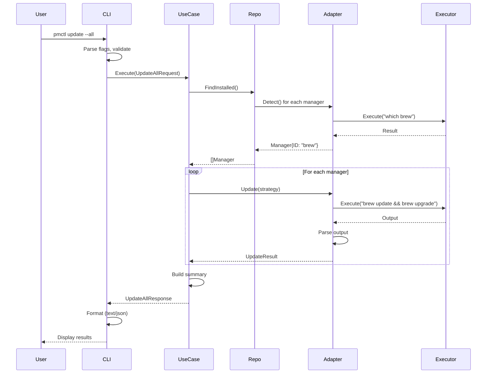

# 5. Data Flow

> gzh-cli-package-manager 아키텍처 문서 · [인덱스](README.md) · [ARCHITECTURE.md](../../ARCHITECTURE.md)

### 5.1 Update Command Flow

```
User Input
    ↓
CLI Command (Presentation)
    ↓
Input Validation
    ↓
UpdateAllManagersUseCase (Application)
    ↓
ManagerRepository.FindInstalled() → Adapters (Infrastructure)
    ↓
For each manager:
    UpdateStrategy.SelectVersion() (Domain)
    ↓
    Adapter.Update() → Shell Execution (Infrastructure)
    ↓
    Parse Output → Domain Entities
    ↓
BuildResponse (Application)
    ↓
Format Output (Presentation)
    ↓
Display to User
```

### 5.2 Sequence Diagram: Update All Managers


